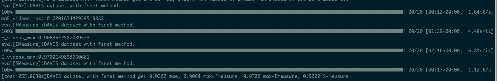
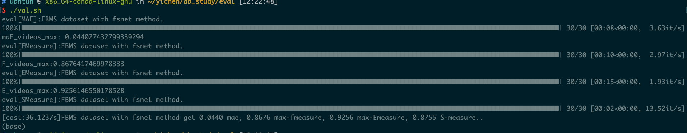
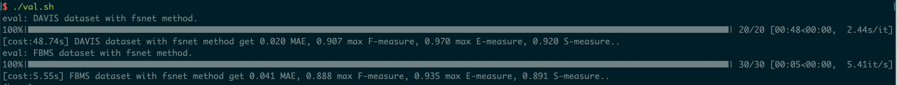

## Evaluation on video saliency object detection (Evaluate VSOD)

---
A **One-key** fast evaluation on video saliency object detection with GPU implementation including **MAE, Max F-measure, S-measure, Max E-measure**.

Code are reimplemented from the matlab version which are available from http://dpfan.net/

* GPU implementation with pytorch which can be easier embedding into eval code.
* One-key evaluation
* **Speed up Max F-measure and Max E-measure (Update!!!)**
* **Optimize data loading method (Update!!!)**
* **Fix some bugs (Update!!!)**

### **Speed comparison before and after update：**

* Before update, DAVIS:



* Before update, FBMS:



* After update, DAVIS FBMS



**example:**

```bash
./val.sh
```
example root_dir:
```
.
├── gt
│   ├── DAVIS2016
│   │   ├── bear
│   │   │   ├── 00001.png
│   │   │   └── 00002.png
│   ├── DAVSOD
│   │   ├── select_0001
│   │   │   ├── 0001.png
│   │   │   └── 0002.png
└── result
│   └── LWL4vsod
│   │   ├── DAVIS2016
│   │   │   ├── bear
│   │   │   │   ├── 00001.png
│   │   │   │   └── 00002.png
│   │   ├── DAVSOD
│   │   │   ├── select_0001
│   │   │   │   ├── 0001.png
│   │   │   │   └── 0002.png
```


If you find the code useful to your research, please cite the following papers.
```
@inproceedings{fan2018SOC,
	title={Salient Objects in Clutter: Bringing Salient Object Detection to the Foreground},
	author={Fan, Deng-Ping and Cheng, Ming-Ming and Liu, Jiang-Jiang and Gao, Shang-Hua and Hou, Qibin and Borji, Ali},
	booktitle = {European Conference on Computer Vision (ECCV)},
	year={2018},
	organization={Springer}
}


@inproceedings{fan2017structure,
	title={{Structure-measure: A New Way to Evaluate Foreground Maps}},
	author={Fan, Deng-Ping and Cheng, Ming-Ming and Liu, Yun and Li, Tao and Borji, Ali},
	booktitle={IEEE International Conference on Computer Vision (ICCV)},
	pages = {4548-4557},
	year={2017},
	note={\url{http://dpfan.net/smeasure/}},
	organization={IEEE}
}

@inproceedings{Fan2018Enhanced,
	author={Fan, Deng-Ping and Gong, Cheng and Cao, Yang and Ren, Bo and Cheng, Ming-Ming and Borji, Ali},
	title={{Enhanced-alignment Measure for Binary Foreground Map Evaluation}},
	booktitle={International Joint Conference on Artificial Intelligence (IJCAI)},
	pages={698--704},
	note={\url{http://dpfan.net/e-measure/}},
	year={2018}
}
```
